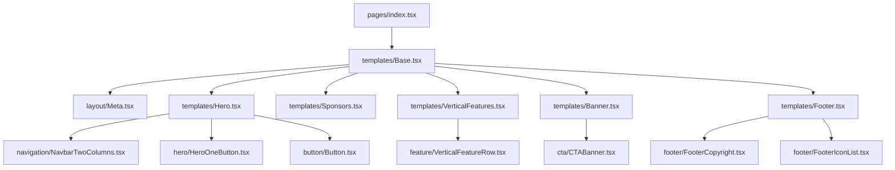

# 🚀 Documentação do Projeto: Landing Page Next.js

> **Disciplina:** DevOps — FATEC  
> **Atividade:** Aula 03 — Clonando e Customizando Landing Pages  
> **Status da Aplicação:** 🟢 Online  
> **Link de Produção:** [Acessar Aplicação na Vercel](https://aula03-clonando-landing-pages-hg37nvp8a.vercel.app/)

---

## 📌 Sumário

1. [Visão Geral](#-visão-geral)
2. [Stack Tecnológica](#-stack-tecnológica)
3. [Estrutura do Projeto](#-estrutura-do-projeto)
4. [Componentes e Arquitetura](#-componentes-e-arquitetura)
5. [Práticas de DevOps e Qualidade de Código](#-práticas-de-devops-e-qualidade-de-código)
6. [Guia de Instalação e Execução](#-guia-de-instalação-e-execução)
7. [Scripts Disponíveis](#-scripts-disponíveis)
8. [Personalização e Customização](#-personalização-e-customização)
9. [Deploy e Integração Contínua](#-deploy-e-integração-contínua)
10. [Licença e Créditos](#-licença-e-créditos)

---

## 📖 Visão Geral

Este projeto consiste em uma **Landing Page moderna, responsiva e de alta performance**, desenvolvida utilizando o ecossistema **Next.js**, **React**, **TypeScript** e **Tailwind CSS**.

O projeto foi estruturado com foco em:
- **Experiência do Desenvolvedor (DX):** Ferramental robusto com linting estrito, formatação automática e validação de tipos.
- **Otimização de Performance (SEO & Core Web Vitals):** Estrutura leve, carregamento rápido e metadados configurados.
- **Modularidade e Reusabilidade:** Componentes desacoplados, facilitando a manutenção e a criação de novas seções.
- **Práticas de DevOps:** Automação de checks locais via Git Hooks (Husky/Lint-Staged) e deploy automatizado na nuvem (Vercel).

---

## 🛠 Stack Tecnológica

| Categoria | Tecnologia | Finalidade |
| :--- | :--- | :--- |
| **Framework Web** | [Next.js 14](https://nextjs.org/) | Renderização estática (SSG), roteamento e otimização |
| **Biblioteca de Interface** | [React 18](https://react.dev/) | Construção de interfaces declarativas e reativas |
| **Linguagem** | [TypeScript 5](https://www.typescriptlang.org/) | Tipagem estática para maior segurança e previsibilidade |
| **Estilização** | [Tailwind CSS 3](https://tailwindcss.com/) | Framework de CSS utilitário para design rápido e responsivo |
| **Processamento CSS** | [PostCSS](https://postcss.org/) & [Autoprefixer](https://github.com/postcss/autoprefixer) | Compatibilidade de CSS entre navegadores |
| **Qualidade & Padronização** | [ESLint](https://eslint.org/) (Airbnb + Next.js) | Análise estática de código e boas práticas |
| **Formatação de Código** | [Prettier](https://prettier.io/) | Padronização automática de estilo de código |
| **Git Hooks** | [Husky](https://typicode.github.io/husky/) + [lint-staged](https://github.com/lint-staged/lint-staged) | Validação automática antes de cada commit |
| **SEO & Metadados** | [next-seo](https://github.com/garmeeh/next-seo) | Otimização para mecanismos de busca e Open Graph |
| **Deploy / Hospedagem** | [Vercel](https://vercel.com/) | Hospedagem em nuvem com CI/CD integrado |

---

## 📁 Estrutura do Projeto

Abaixo está o detalhamento da organização de diretórios e arquivos:

```text
Aula 03/
├── Hospedagem.md               # Informações e link da aplicação em produção
├── DOCUMENTACAO.md             # Esta documentação completa do projeto
└── Atividade_sobre_Landing_Pages/
    ├── .husky/                 # Configurações de Git Hooks (pré-commit)
    ├── .vscode/                # Configurações e extensões recomendadas para o VS Code
    ├── public/                 # Arquivos estáticos (imagens, ícones, logos, SVGs)
    │   └── assets/
    │       └── images/         # Imagens utilizadas nos templates e componentes
    ├── src/
    │   ├── background/         # Componentes de fundo (Background.tsx)
    │   ├── button/             # Componentes de botões reutilizáveis (Button.tsx)
    │   ├── cta/                # Seção de Chamada para Ação (CTABanner.tsx)
    │   ├── feature/            # Linhas de funcionalidades/recursos (VerticalFeatureRow.tsx)
    │   ├── footer/             # Componentes de rodapé (FooterCopyright.tsx, FooterIconList.tsx, etc.)
    │   ├── hero/               # Componente de cabeçalho principal (HeroOneButton.tsx)
    │   ├── layout/             # Componentes de estrutura e layout (Meta.tsx, Section.tsx)
    │   ├── navigation/         # Menu de navegação (NavbarTwoColumns.tsx)
    │   ├── pages/              # Páginas e rotas do Next.js (_app.tsx, _document.tsx, index.tsx)
    │   ├── styles/             # Arquivos globais de estilo CSS (global.css)
    │   ├── templates/          # Montagem das seções da Landing Page (Base.tsx, Hero.tsx, Banner.tsx, etc.)
    │   └── utils/              # Configurações gerais da aplicação (AppConfig.ts)
    ├── .eslintrc               # Regras do linter ESLint
    ├── lint-staged.config.js   # Regras executadas em arquivos staged no git
    ├── next.config.js          # Configurações do Next.js
    ├── package.json            # Dependências e scripts do projeto
    ├── postcss.config.js       # Configuração dos plugins PostCSS
    ├── tailwind.config.js      # Configuração de temas, cores e utilitários do Tailwind
    └── tsconfig.json           # Configurações do compilador TypeScript
```

---

## 🧱 Componentes e Arquitetura

O projeto adota uma arquitetura em camadas orientada a componentes atômicos e templates:



### Principais Seções:

1. **Meta (SEO):**
   - Gerencia `<title>`, `<meta name="description">` e tags Open Graph para redes sociais.
   - Consome as definições do arquivo `src/utils/AppConfig.ts`.

2. **Hero Section (`src/templates/Hero.tsx`):**
   - Barra de navegação com Logo e Links.
   - Título de alto impacto com destaque visual em gradiente/cores primárias.
   - Botão de ação (CTA) principal direcionando o usuário.

3. **Sponsors Section (`src/templates/Sponsors.tsx`):**
   - Grade de exibição de logotipos e parceiros/apoiadores do projeto.

4. **Features Section (`src/templates/VerticalFeatures.tsx`):**
   - Exibe blocos de funcionalidades com imagens ilustrativas e textos explicativos.
   - Utiliza alternância de posições (imagem à esquerda / direita) de forma responsiva.

5. **CTA Banner (`src/templates/Banner.tsx`):**
   - Faixa de chamada para ação final para conversão de leads ou cadastros.

6. **Footer Section (`src/templates/Footer.tsx`):**
   - Links de navegação secundários, créditos, copyright e ícones de redes sociais.

---

## ⚙️ Práticas de DevOps e Qualidade de Código

Para assegurar estabilidade, manutenibilidade e entrega contínua de alta qualidade, o projeto inclui:

### 1. Linting e Formatação
- **ESLint:** Regras estritas baseadas no padrão Airbnb com suporte total a TypeScript, React Hooks e Tailwind CSS.
- **Prettier:** Formatação determinística de código, JSONs e YAMLs.

### 2. Automação de Git Hooks
- **Husky & lint-staged:** Antes de qualquer `git commit`, os arquivos modificados passam automaticamente por validação de tipagem (`check-types`), linting (`eslint`) e formatação (`prettier`), impedindo que código quebrado entre no repositório.

### 3. Análise de Bundle (Performance)
- Integração com `@next/bundle-analyzer` para inspecionar o tamanho dos módulos gerados no build e garantir carregamento rápido.

---

## 🚀 Guia de Instalação e Execução

### Pré-requisitos
- [Node.js](https://nodejs.org/) versão `18.x` ou superior.
- Gerenciador de pacotes `npm`, `yarn` ou `pnpm`.
- [Git](https://git-scm.com/) instalado.

### Passo a Passo

1. **Clonar o Repositório:**
   ```bash
   git clone https://github.com/FelipeFDSDev/DevOps_FATEC_FelipeFS.git
   cd "DevOps_FATEC_FelipeFS/Aula 03/Atividade_sobre_Landing_Pages"
   ```

2. **Instalar as Dependências:**
   ```bash
   npm install
   ```

3. **Executar o Servidor de Desenvolvimento:**
   ```bash
   npm run dev
   ```

4. **Acessar no Navegador:**
   Abra [http://localhost:3000](http://localhost:3000) no seu navegador para visualizar a Landing Page.

---

## 📜 Scripts Disponíveis

No diretório `Atividade_sobre_Landing_Pages`, você pode executar os seguintes comandos via terminal:

| Comando | Descrição |
| :--- | :--- |
| `npm run dev` | Inicia o servidor de desenvolvimento na porta `3000` |
| `npm run build` | Cria a build otimizada para produção |
| `npm run start` | Inicia o servidor local apontando para a build de produção |
| `npm run build-prod` | Executa limpeza do cache (`clean`) e cria a build final |
| `npm run clean` | Remove as pastas de compilação `.next`, `.swc` e `out` |
| `npm run lint` | Executa a verificação estática de código com o ESLint |
| `npm run format` | Corrige problemas de formatação e aplica Prettier |
| `npm run check-types` | Valida todos os tipos TypeScript sem emitir arquivos |
| `npm run build-stats` | Gera relatório visual detalhado do tamanho dos pacotes (Bundle Analyzer) |

---

## 🎨 Personalização e Customização

### 1. Configurações Globais (Título, Nome, Descrição e Idioma)
Edite o arquivo [AppConfig.ts](file:///c:/Users/Nefalem/Desktop/DevOps_FATEC_FelipeFS/Aula%2003/Atividade_sobre_Landing_Pages/src/utils/AppConfig.ts):
```typescript
export const AppConfig = {
  site_name: 'Meu Projeto',
  title: 'Título da Minha Landing Page',
  description: 'Descrição impactante da minha Landing Page',
  locale: 'pt-BR',
};
```

### 2. Estilização e Cores
As variáveis de cores e configurações do Tailwind estão centralizadas em [tailwind.config.js](file:///c:/Users/Nefalem/Desktop/DevOps_FATEC_FelipeFS/Aula%2003/Atividade_sobre_Landing_Pages/tailwind.config.js).
Para alterar a paleta de cores primárias ou secundárias:
```javascript
module.exports = {
  theme: {
    extend: {
      colors: {
        primary: {
          100: '#E6FFFA',
          200: '#B2F5EA',
          // Customize seus tons aqui
          500: '#319795',
        },
      },
    },
  },
};
```

### 3. Modificação das Seções
- **Cabeçalho / Hero:** edite `src/templates/Hero.tsx`.
- **Recursos / Features:** edite `src/templates/VerticalFeatures.tsx`.
- **Patrocinadores:** edite `src/templates/Sponsors.tsx`.
- **Chamada Final (CTA):** edite `src/templates/Banner.tsx`.
- **Rodapé:** edite `src/templates/Footer.tsx`.

---

## 🌐 Deploy e Integração Contínua

### Deploy na Vercel (Recomendado)
A aplicação está hospedada e configurada com deploy contínuo através da plataforma Vercel:
1. Conecte o repositório GitHub à sua conta Vercel.
2. Defina o **Root Directory** como `Aula 03/Atividade_sobre_Landing_Pages`.
3. O comando de build padrão (`npm run build`) e o diretório de saída (`.next`) são detectados automaticamente.
4. A cada novo push na branch principal, uma nova versão é publicada instantaneamente.

**URL de Produção Ativa:**  
👉 [https://aula03-clonando-landing-pages-hg37nvp8a.vercel.app/](https://aula03-clonando-landing-pages-hg37nvp8a.vercel.app/)

---

## 📄 Licença e Créditos

- Projeto desenvolvido para fins educacionais na disciplina de **DevOps** da **FATEC**.
- Licença sob os termos da licença ISC.
